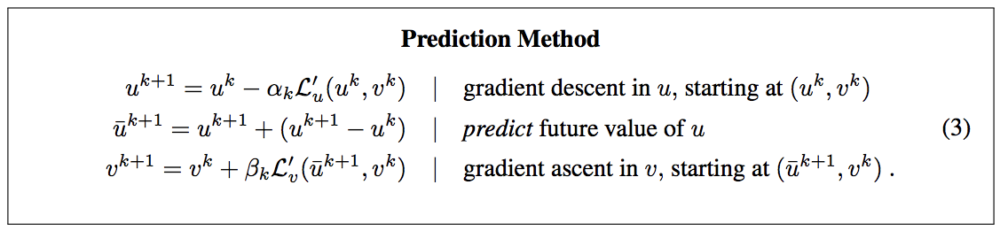
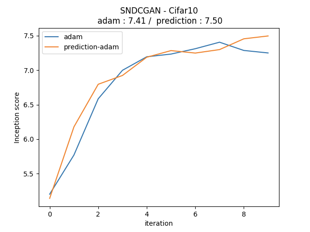
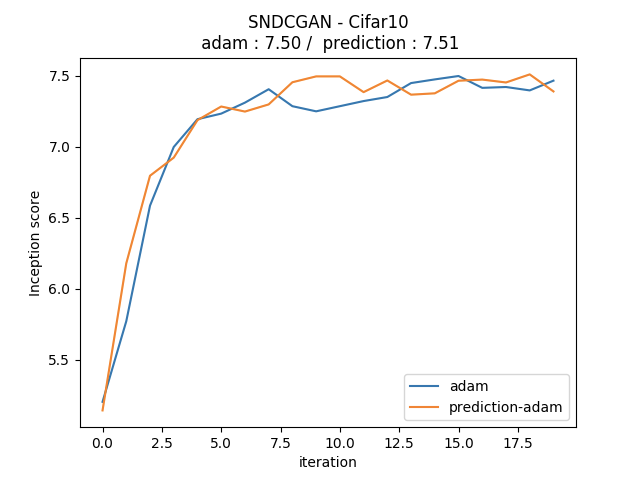

# StableGAN-Tensorflow
Simple Tensorflow implementation of Stabilizing Adversarial Nets With Prediction Methods (ICLR 2018)

## Summary


## Usage
```python

from Adam_prediction import Adam_Prediction_Optimizer
G_op = Adam_Prediction_Optimizer(learning_rate=0.001, beta1=0.9, beta2=0.999, prediction=True)
D_op = Adam_Prediction_Optimizer(learning_rate=0.001, beta1=0.9, beta2=0.999, prediction=False)

```

## Result
### Inception score (SNDCGAN - 100K iteration, Max value)


### Inception score (SNDCGAN - 200K iteration, Max value)


### Comparison with Average inception score for 0 ~ 200K iteration
* adam : 7.12
* adam-prediction : 7.17

## Related works
* [Spectral Normalization[(https://github.com/taki0112/Spectral_Normalization-Tensorflow)

## Author
Junho Kim
